# **💉 암 환자 고위험군 및 사망률 예측**
---

## 1. **팀 소개**
### 🚑  응급디버깅실 (ER) 🚑
코드 터지면 바로 실려옴 💻

## 🧬 팀원 소개 
---
<table>
  <tr>
    <td align="center" width="200px">
      <br/>
      <b>박준영</b>
    </td>
    <td align="center" width="200px">
      <br/>
      <b>강지완</b>
    </td>
    <td align="center" width="200px">
      <br/>
      <b>김민정</b>
    </td>
    <td align="center" width="200px">
      <br/>
      <b>이승원</b>
    </td>
   <td align="center" width="200px">
      <br/>
      <b>박소희</b>
    </td>
  </tr>
  <tr>
    <td align="center" width="200px">
      <a href="https://github.com/deneb784"> GitHub</a>
    </td>
    <td align="center" width="200px">
      <a href="https://github.com/Maroco0109"> GitHub</a>
    </td>
    <td align="center" width="200px">
      <a href="https://github.com/MinJeung-Kim"> GitHub</a>
    </td>
    <td align="center" width="200px">
      <a href="https://github.com/seungwon-sw"> GitHub</a>
    </td>
     <td align="center" width="200px">
      <a href="https://github.com/xxoysauce"> GitHub</a>
    </td>
  </tr>
  
  
</table>


---

## 2. **프로젝트 개요**
---
### 2.1. 프로젝트 명
### **암 환자 고위험군 및 이탈율 예측**

### 2.2. 프로젝트 주제 선정 배경
> 병원 관점에서 질병 환자의 **사망**은 단순한 의료적 사건이 아니라, **고객의 이탈(churn)** 과 유사한 개념으로 볼 수 있다.


- 완치율이 높은 병원은 환자의 신뢰를 얻어 재방문율이 높고, 새로운 환자 유입도 활발하다.
- 반면 사망률이 높은 병원은 환자의 신뢰 하락으로 인해 내원율이 감소하고, 기존 환자들이 다른 병원으로 이동하는 등 **고객 유지율(환자 유지율)** 이 떨어지는 경향을 보인다.

따라서 병원 경영 측면에서는 **고위험군 환자를 조기에 식별**하고, 치료 개입이나 관리 강화를 통해 위험을 완화하는 것이 매우 중요하다.
이는 단순한 질병 통계 분석을 넘어, 병원의 **서비스 지속성과 환자 관리 효율성**을 높이는 핵심 전략으로 기능한다.

### 2.3. 프로젝트 목적
암 환자에 대한 관찰과 추적은 지속적으로 이루어져야한다. 특정 기간에 대한 생존율을 예측하기에는 장기 치료가 불가피한 경우도 많기에, 다양한 기간에서의 생존율을 예측할 필요가 있다.    
따라서 해당 프로젝트에서는 각 시간대별, 사망 원인별 환자의 생존율을 추정하여 각 환자에 맞는 관리 전략을 제공하는데 도움을 주고자 한다.

1. 암 환자의 시간에 따른 생존율 예측

- 생존 분석(Survival Analysis)을 통해 환자의 경과 시간에 따른 생존 확률을 추정한다.

2. 주요 사망 원인별 사망률 예측 및 생존 기간 산출

- 암 유형별·사망 원인별로 사망 확률을 분석하여 환자의 예상 생존 기간을 예측한다.

3. 예측 기반 위험 점수(Risk Score) 산출

- 예측된 생존율을 바탕으로 환자별 위험도를 0~100점 범위로 정량화하고,
고위험군 환자를 직관적으로 식별할 수 있는 관리 지표를 제공한다.

4. 생존 인원들의 치료 중단 시기 예측
- 예측된 생존율을 바탕으로 생존이 예측되는 인원들 역시 치료 중단 시기를 예측한다.


---
## 3-1. **기술 스택**


| **카테고리** | **기술스택** |
| :--- | :--- |
| **WEB** |  |
| **라이브러리** |      |
| **개발 환경 및 협업 도구** |    |


## 3-2. **파일 구조**

```
TEAMPROJECT/
└─ SKN19_2ND_5TEAM/
   ├─ data/
   │  │
   │  ├─ 2022Data_part1.csv
   │  ├─ 2022Data_part2.csv
   │  ├─ categories_select.csv
   │  ├─ encoded_dataset_COD.csv
   │  ├─ encoded_dataset.csv
   │  ├─ Suicide_encode.csv
   │  ├─ Suicide.csv
   │  └─ test dataset.csv
   │
   ├─ insight/
   │  ├─ COD list.ipynb
   │  ├─ data_encode_insight_kmj.ipynb
   │  ├─ data_insight_kjw.ipynb
   │  ├─ data_insight_kmj.ipynb
   │  ├─ data_insight_lsw.ipynb
   │  ├─ EDA.ipynb
   │  └─ encoded_label_dump.txt
   │
   ├─ modules/
   │  ├─ __init__.py
   │  ├─ DataAnalysis.py
   │  ├─ DataModify.py
   │  ├─ DataSelect.py
   │  ├─ ModelAnalysis.py
   │  ├─ Models.py
   │  └─ smart_csv.py
   │
   ├─ parameters/
   │  ├─ categories.pkl
   │  ├─ deephit_model_2D_CNN.pth
   │  ├─ deephit_model_CNN.pth
   │  ├─ deephit_model_Concat.pth
   │  ├─ deephit_model_feature.pth
   │  └─ deephit_model_feature_original_Deephit.pth 
   │
   ├─ .gitignore
   ├─ Analysis.ipynb
   ├─ environment.yml
   ├─ pyproject.toml
   ├─ README.md
   ├─ run.py
   ├─ test.ipynb
   └─ train.ipynb

```

## 4. **WBS**
    
    
<html lang="ko"><head>
  <meta charset="UTF-8">
</head>
<body>
<table>
  <thead>
    <tr>
      <th align="left">WBS Number</th>
      <th align="left">Task Title</th>
      <th align="left">담당자</th>
      <th align="left">시작일</th>
      <th align="left">종료일</th>
      <th align="left">산출물</th>
    </tr>
  </thead>
  <tbody>
    <tr>
      <td align="left">1</td>
      <td align="left">프로젝트 컨셉트 및 방향성</td>
      <td align="left">ALL</td>
      <td align="left">2025.9.30</td>
      <td align="left">2025.10.5</td>
      <td align="left">2022Data_part1.csv<br>2022Data_part2.csv</td>
    </tr>
    <tr>
      <td align="left">1.1.</td>
      <td align="left">프로젝트 주제 선정</td>
      <td align="left">ALL</td>
      <td align="left">2025.9.30</td>
      <td align="left">2025.10.2</td>
      <td align="left"></td>
    </tr>
    <tr>
      <td align="left">1.2</td>
      <td align="left">데이터셋 분석</td>
      <td align="left">ALL</td>
      <td align="left">2025.10.1</td>
      <td align="left">2025.10.5</td>
      <td align="left"></td>
    </tr>
    <tr>
      <td align="left">1.2.1</td>
      <td align="left">타겟 레이블 분석</td>
      <td align="left">ALL</td>
      <td align="left">2025.10.1</td>
      <td align="left">2025.10.2</td>
      <td align="left"></td>
    </tr>
    <tr>
      <td align="left">1.2.2</td>
      <td align="left">컬럼명 분석</td>
      <td align="left">ALL</td>
      <td align="left">2025.10.1</td>
      <td align="left">2025.10.5</td>
      <td align="left"></td>
    </tr>
    <tr>
      <td align="left">1.2.3</td>
      <td align="left">피처값 분석 (컬럼 내용)</td>
      <td align="left">ALL</td>
      <td align="left">2025.10.1</td>
      <td align="left">2025.10.5</td>
      <td align="left"></td>
    </tr>
    <tr>
      <td align="left">2</td>
      <td align="left">EDA</td>
      <td align="left">강지완, 김민정, 이승원</td>
      <td align="left">2025.10.2</td>
      <td align="left">2025.10.10</td>
      <td align="left">encoded_dataset.csv<br>encoded_dataset_COD.csv</td>
    </tr>
    <tr>
      <td align="left">2.1</td>
      <td align="left">데이터셋 인코딩</td>
      <td align="left">강지완, 박소희, 박준영</td>
      <td align="left">2025.10.2</td>
      <td align="left">2025.10.3</td>
      <td align="left">Analysis.ipynb<br>DataModify.ipynb<br>DataSelect.py</td>
    </tr>
    <tr>
      <td align="left">2.1</td>
      <td align="left">데이터 기본 정보 분석</td>
      <td align="left">강지완, 김민정, 이승원</td>
      <td align="left">2025.10.10</td>
      <td align="left">2025.10.12</td>
      <td align="left">data_insight_kjw.ipynb<br>data_insight_kmj.ipynb<br>data_insight_lsw.ipynb</td>
    </tr>
    <tr>
      <td align="left">2.2</td>
      <td align="left">사망 원인 기반 정보 분석</td>
      <td align="left">강지완, 김민정, 이승원</td>
      <td align="left">2025.10.10</td>
      <td align="left">2025.10.14</td>
      <td align="left">data_insight_kjw.ipynb<br>data_insight_kmj.ipynb<br>data_insight_lsw.ipynb</td>
    </tr>
    <tr>
      <td align="left">2.3</td>
      <td align="left">타겟 레이블 상관관계 분석</td>
      <td align="left">강지완, 김민정, 이승원</td>
      <td align="left">2025.10.10</td>
      <td align="left">2025.10.14</td>
      <td align="left">EDA.ipynb<br>DataModify.ipynb<br>DataAnalysis.ipynb</td>
    </tr>
    <tr>
      <td align="left">3</td>
      <td align="left">Modeling</td>
      <td align="left">박소희, 박준영</td>
      <td align="left">2025.10.2</td>
      <td align="left">2025.10.15</td>
      <td align="left"></td>
    </tr>
    <tr>
      <td align="left">3.1</td>
      <td align="left">기본 모델 구현</td>
      <td align="left">박준영</td>
      <td align="left">2025.10.2</td>
      <td align="left">2025.10.15</td>
      <td align="left">Models.py<br>ModelAnalysis.py<br>train.ipynb<br>test.ipynb<br>accuraccy_test.ipynb<br>code_test.ipynb</td>
    </tr>
    <tr>
      <td align="left">3.2</td>
      <td align="left">모듈 추가 및 각 모델 학습</td>
      <td align="left">박소희, 박준영</td>
      <td align="left">2025.10.6</td>
      <td align="left">2025.10.12</td>
      <td align="left">deephit_model_2D_CNN.pth<br>deephit_model_feature_2dcnn.pth<br>risk_model_event_linears.pth</td>
    </tr>
    <tr>
      <td align="left">3.3</td>
      <td align="left">모델 구조 시각화</td>
      <td align="left">박준영, 박소희</td>
      <td align="left">2025.10.10</td>
      <td align="left">2025.10.12</td>
      <td align="left">Deephit CNN.png<br>Deephit_original.png<br>model2.png<br>original model.png</td>
    </tr>
    <tr>
      <td align="left">4</td>
      <td align="left">README 정리</td>
      <td align="left">ALL</td>
      <td align="left">2025.10.11</td>
      <td align="left">2025.10.15</td>
      <td align="left">README.md</td>
    </tr>
    <tr>
      <td align="left">4.1</td>
      <td align="left">README 초안 작성</td>
      <td align="left">박소희</td>
      <td align="left">2025.10.11</td>
      <td align="left">2025.10.13</td>
      <td align="left"></td>
    </tr>
    <tr>
      <td align="left">4.2</td>
      <td align="left">EDA 및 시각화 정리</td>
      <td align="left">김민정</td>
      <td align="left">2025.10.14</td>
      <td align="left">2025.10.14</td>
      <td align="left"></td>
    </tr>
    <tr>
      <td align="left">4.3</td>
      <td align="left">데이터 전처리 방법 정리</td>
      <td align="left">강지완</td>
      <td align="left">2025.10.14</td>
      <td align="left">2025.10.14</td>
      <td align="left"></td>
    </tr>
    <tr>
      <td align="left">4.4</td>
      <td align="left">모델 학습 결과 정리</td>
      <td align="left">박준영, 박소희</td>
      <td align="left">2025.10.12</td>
      <td align="left">2025.10.15</td>
      <td align="left"></td>
    </tr>
    <tr>
      <td align="left">5</td>
      <td align="left">Streamlit 구현</td>
      <td align="left">김민정, 박소희, 박준영, 이승원</td>
      <td align="left">2025.10.13</td>
      <td align="left">2025.10.15</td>
      <td align="left">run.py</td>
    </tr>
    <tr>
      <td align="left">5.1</td>
      <td align="left">Streamlit 초안 작성</td>
      <td align="left">박준영</td>
      <td align="left">2025.10.13</td>
      <td align="left">2025.10.13</td>
      <td align="left"></td>
    </tr>
    <tr>
      <td align="left">5.2</td>
      <td align="left">전체 UI 구성 및 차트 디자인 변경</td>
      <td align="left">김민정, 박소희, 이승원</td>
      <td align="left">2025.10.14</td>
      <td align="left">2025.10.15</td>
      <td align="left"></td>
    </tr>
    <tr>
      <td align="left">5.3</td>
      <td align="left">UI 병합 및 내용 보충</td>
      <td align="left">박준영, 박소희</td>
      <td align="left">2025.10.14</td>
      <td align="left">2025.10.15</td>
      <td align="left"></td>
    </tr>
  </tbody>
</table>


</body></html>


## 5. **데이터 전처리 및 EDA**
   
모델의 학습과 평가에 사용한 데이터는 미국국립암연구소(NCI)에서 제공하는 암 환자에 대한 데이터셋인 SEER(Surveillance, Epidemiology, and End Results) 데이터셋의 일부를 사용하였다.   
2022년에 내원한 기록이 있는 주요 4대 암(폐, 간, 위, 대장) 환자에 대한 데이터 약 500,000개를 기반으로 해당 과정을 진행하였다.
   
### [데이터 전처리]
```modules/DataModify.py```
---------------------
```python
# DataPreprocessing
├─ category_encoding()                # 범주형 컬럼을 라벨/원-핫 인코딩
├─ decode_csv_features()              # 범주형 변수를 모델에 적용할 수 있도록 디코딩
├─ encode_ordinal_columns()           # 정의된 순서(또는 수치 그대로 유지)를 적용해 순서형 변수 일관성을 유지
├─ encode_nominal_columns()           # 명목형 변수(순서가 없는 범주형 변수) 전체를 새 ID로 팩터라이즈하고 결측은 -1로 통일
├─ create_combined_label()            # 생존 상태·사망원인을 조합해 `target_label` 다중 클래스를 구축
├─ bin_survival_months()              # 생존 개월을 3개.단위 등 균일 구간으로 나눠 시간 기반 특징 강화
└─ _normalize_seer_summary_stage()    # 확장 병기 코드를 0/1/2/3/9 표준 범주로 정규화
```
---
### [ 데이터 기본 정보 분석 ] 
  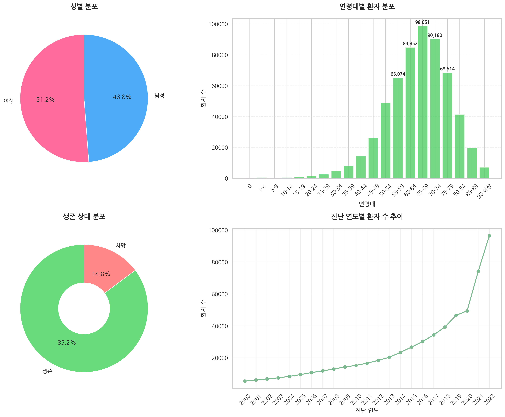
  

### [ 사망 원인 및 상관관계 분석 ] 
  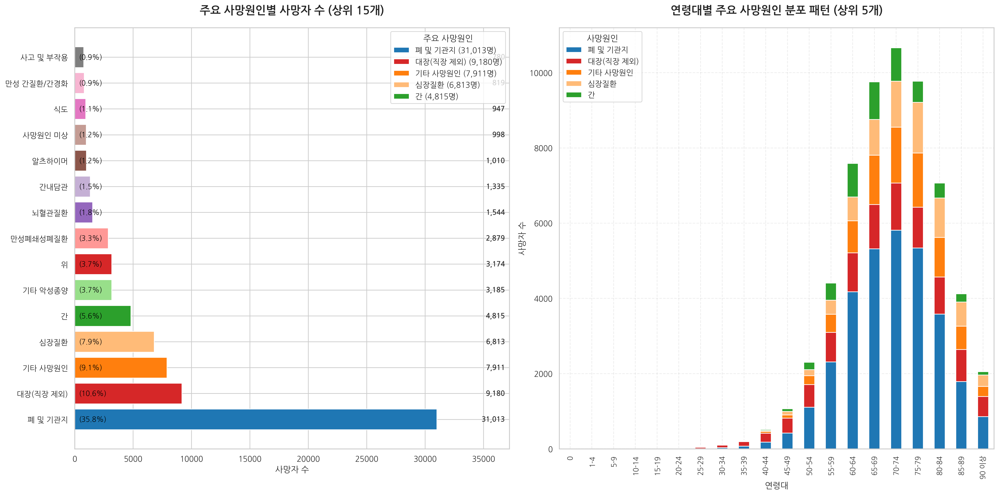
  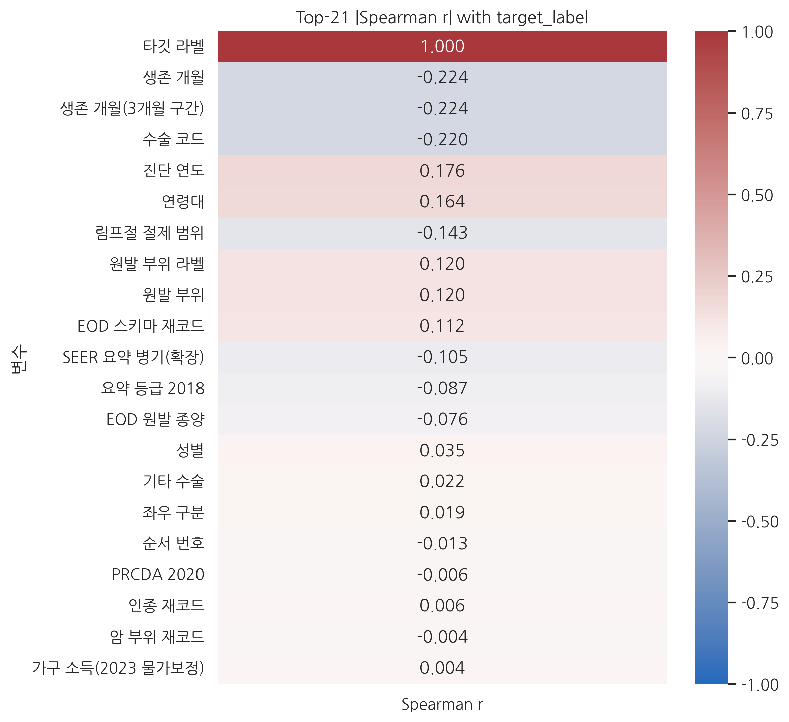 
   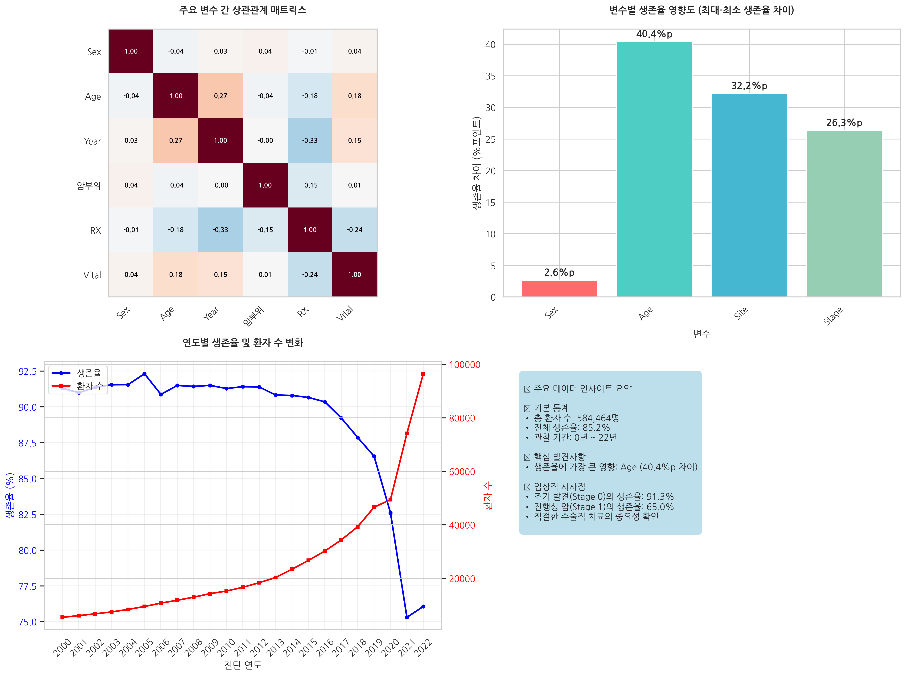
   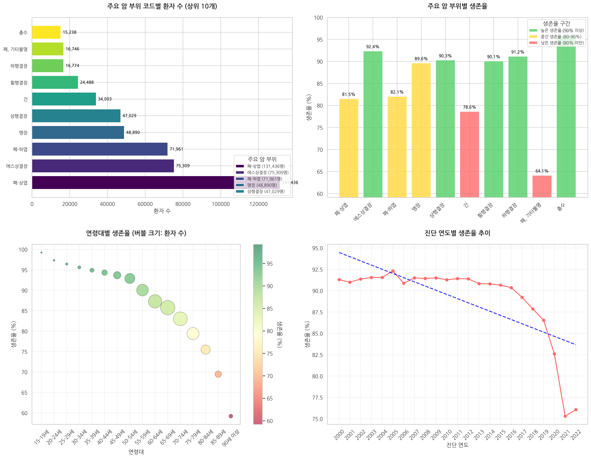
   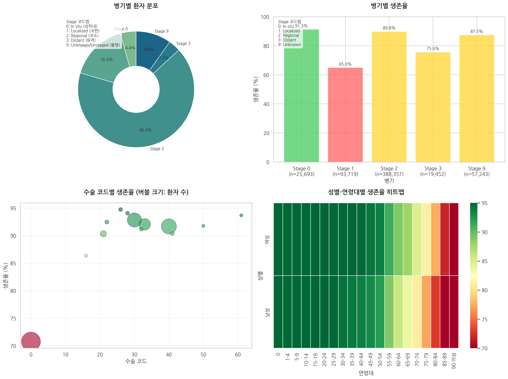
  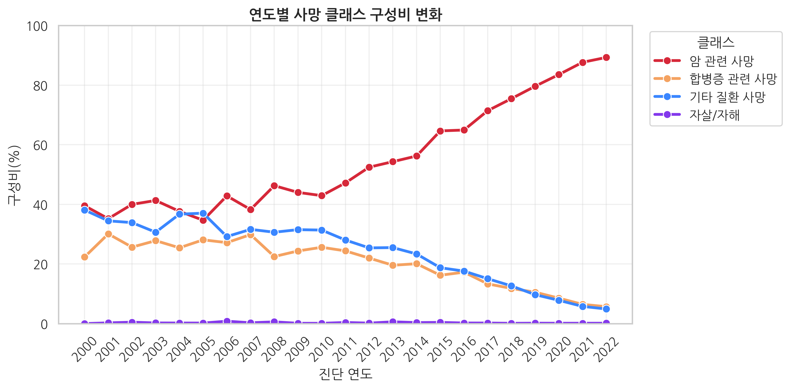 
   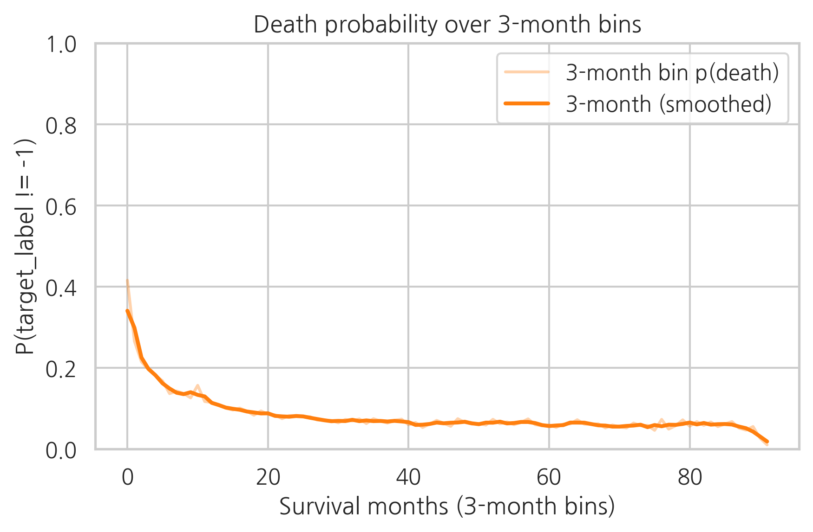
    
   
### [ 타겟 레이블 상관관계 분석 ]  
  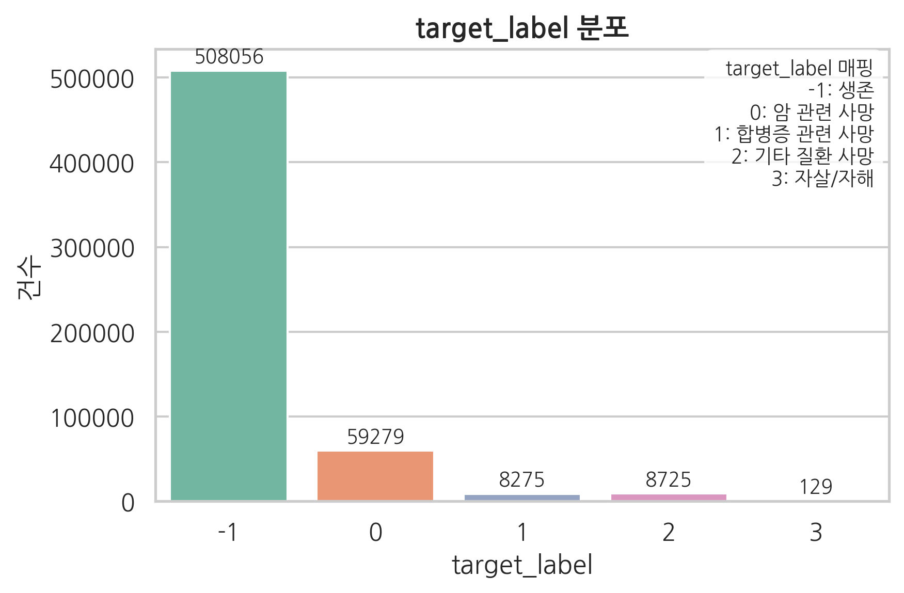
    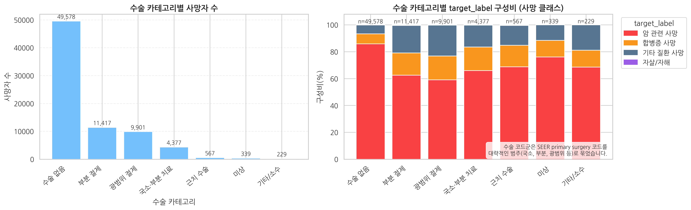
     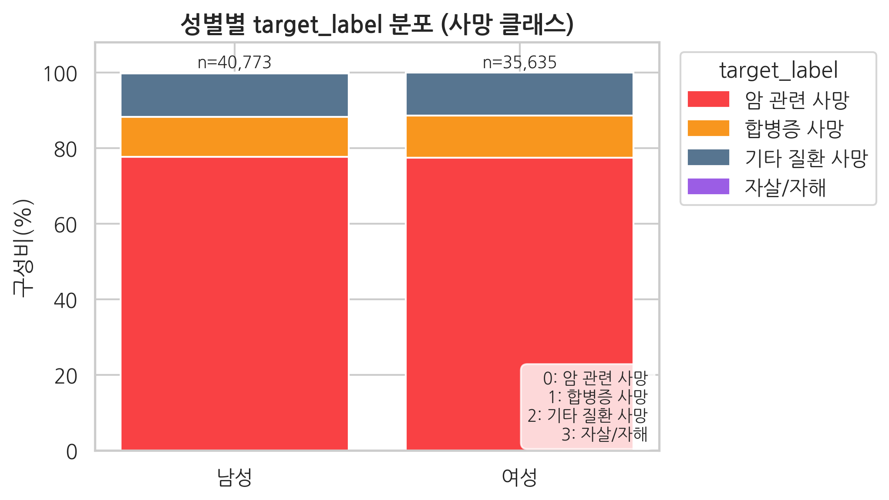
     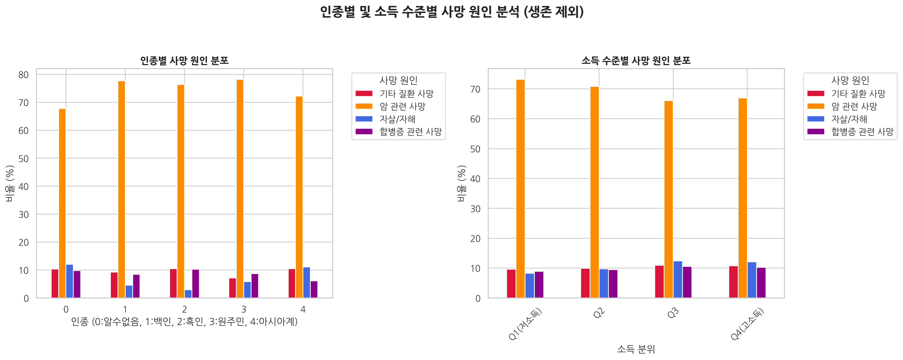

###  [  모델 입력 특성 ] 

<table style='width:100%; border-collapse:collapse; font-size:0.95rem;'>
  <tr><td><b>Sex</b></td><td>성별</td></tr>
  <tr><td><b>Age recode with &lt;1 year olds and 90+</b></td><td>연령대</td></tr>
  <tr><td><b>Year of diagnosis</b></td><td>진단 연도</td></tr>
  <tr><td><b>Race recode (W, B, AI, API)</b></td><td>인종 코드</td></tr>
  <tr><td><b>Primary Site</b></td><td>암 발생 부위</td></tr>
  <tr><td><b>Primary Site - labeled</b></td><td>암 발생 부위 라벨</td></tr>
  <tr><td><b>Derived Summary Grade 2018 (2018+)</b></td><td>암세포 악성도 등급</td></tr>
  <tr><td><b>Laterality</b></td><td>장기 좌우 구분</td></tr>
  <tr><td><b>EOD Schema ID Recode (2010+)</b></td><td>암 진행 단계 분류 코드</td></tr>
  <tr><td><b>Combined Summary Stage with Expanded Regional Codes (2004+)</b></td><td>암 진행 단계</td></tr>
  <tr><td><b>RX Summ--Surg Prim Site (1998+)</b></td><td>수술 코드</td></tr>
  <tr><td><b>RX Summ--Scope Reg LN Sur (2003+)</b></td><td>림프절 절제 범위</td></tr>
  <tr><td><b>RX Summ--Surg Oth Reg/Dis (2003+)</b></td><td>기타 수술</td></tr>
  <tr><td><b>Sequence number</b></td><td>암 확진 횟수</td></tr>
  <tr><td><b>Median household income inflation adj to 2023</b></td><td>가구 소득(2023 물가보정)</td></tr>
  <tr><td><b>EOD Primary Tumor Recode (2018+)</b></td><td>암의 전이 정도</td></tr>
  <tr><td><b>PRCDA 2020</b></td><td>PRCDA 2020</td></tr>
</table>

## 6. **인공지능 학습 결과서**
---

### 6-1. 기본 모델 아이디어
 해당 시스템은 환자에 대한 사망원인별 연속적인 사망률을 예측하여, 고위험 요인에 대한 선제적 조치와 예방을 목적으로 한다.  
 따라서 여러 시간대별 사망률을 예측할 수 있는 모델을 필요로 하고, 해당 형태를 구현하기 위하여 딥러닝 모델을 구현하여 사용하였다.  
 기본 모델의 형태와 손실함수는 *DeepHit: A Deep Learning Approach to Survival Analysis with Competing Risks.* (Lee, Changhee, et al., 2018)를 기반으로 작성하였다.  

 <div align="center">
      
    <br>
    <i> Deephit 모델의 기본 구조 </i>
</div>


  DeepHit모델은 특성을 공유 Branch와 각 사건별 Branch에 차례대로 통과시켜 이산화시킨 시간 별 사건 발생 확률을 예측하는 형태의 모델이다.

### 6-2. 모델 개선 아이디어
  Deephit 모델은 시간대별 사건 발생 확률을 예측하는 MLP 기반의 모델로, 학습 과정에 여러 모듈을 추가하여 성능 개선을 도모할 수 있다.

#### 6-2.1. SEBlock (Squeeze-and-Excitation Block)
  StandardScaler, MinMaxScaler 대신 특성 중요도에 따라 특성마다 서로 다른 가중치를 줄 수 있게 하는 모듈을 삽입하여 성능을 높일 수 있다.    
  *Squeeze-and-Excitation Networks (Jie Hu, Li Shen, Gang Sun, 2018)* 에서 사용된 SEBlock 아이디어를 단순 특성 MLP에 적용하여 특성을 변환

#### 6-2.2. Residual Connection, Feature-wise Concat
  잔차 또는 기존 특성을 모델 중간에 삽입해주어 학습률을 높이고 성능을 안정화 시킬 수 있다.
   
  > 모델의 깊이가 깊지 않아 성능에 도움을 주지 않아 최종 모델에서는 사용하지 않음

#### 6-2.3. 1D, 2D CNN
  모델의 결과에 시간대별, 사건별 연관성을 추가하기 위하여 CNN을 사용

### **📊 모델별 학습 결과**

#### **모델 성능 평가 지표**
- Concordance Index (C-index) : 임의의 사건 두 개를 뽑아서 어떤 사건이 더 먼저 발생했는지 비교했을때, 해당 비교에 대한 정확도
- Integrated Brier Score (IBS) : 모델의 시간대별 오차 제곱의 평균 (MSE의 시간축에 대한 적분)
- MAE of predicted time : 모델이 예측한 생존 기간과, 실제 생존 기간 사이의 평균 오차

<table>
  <tr>
    <th>활용모델</th>
    <th>Concordance Index (C-index)</th>
    <th>Integrated Brier Score (IBS)</th>
    <th>MAE of predicted time</th>
    <th>Hyper parameters</th>
  </tr>
  <tr>
    <th scope="row" style="text-align:left;">SEBlock</th>
    <td>0.6412</td><td>0.2130</td><td>3.2790</td>
    <td>Hidden layer: (128, 64),<br> Time bins : 91,<br> SE ratio : 0.25</td>
  </tr>
  <tr>
    <th scope="row" style="text-align:left;">SEBlock + Feature concat</th>
    <td>0.5558</td><td>0.2463</td><td>4.6994</td>
    <td>Hidden layer: (128, 64),<br>  
      Time bins : 91,<br>  
      SE ratio : 0.25</td>
  </tr>
  <tr>
    <th scope="row" style="text-align:left;">SEBlock + 1-dimensional CNN</th>
    <td>0.7302</td><td>0.2116</td><td>3.6853</td>
    <td>Hidden layer: (128, 64),<br> Time bins : 91,<br> 
      SE ratio : 0.25,<br> CNN kernel size : 3</td>
  </tr>
  <tr>
    <th scope="row" style="text-align:left;">SEBlock + 2-dimensional CNN</th>
    <td>0.8263</td><td>0.2005</td><td>2.9128</td>
    <td>Hidden layer: (128, 64),<br> Time bins : 91,<br> SE ratio : 0.25,<br> CNN kernel size: (2,5), (2,3)</td>
  </tr>
  <tr>
    <th scope="row" style="text-align:left;">SEBlock + 2-dimensional CNN(with BN + Scheduler)</th>
    <td>0.9144</td><td>0.1638</td><td>5.3622</td>
    <td>Hidden layer: (128, 64),<br> Time bins : 91,<br> SE ratio : 0.25, Dropout : 0.25, alpha : 0.4, lr : 8e-5, weight decay : 1e-5<br> CNN kernel size: (2,5), (2,3)</td>
  </tr>
</table>


### 6-3. 최종 모델 형태

<div align="center">
  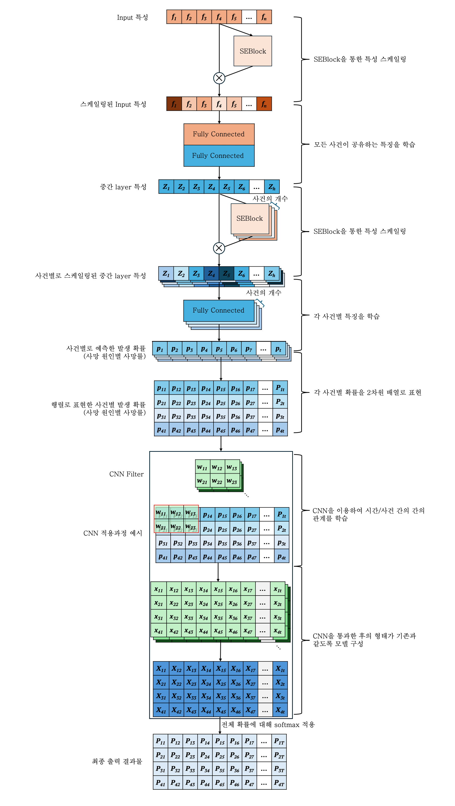
  <br>
  <i> 최종 Deephit 모델 </i>
</div>

<br>

<div align="center">
  
  <br>
  <i> 최종 모델의 상세 구조 </i>
</div>

### 6-4. 위험 점수 계산

모델을 통해 얻은 시간대별 사건 발생 확률(pmf)에 대한 가중치합을 계산한 후 Sigmoid를 통하여 0~100점 사이의 점수로 변환    
가까운 시일 내에 사망할 확률이 높을 수록 높은 위험점수를 나타냄

### 6-5. 하이퍼파라미터 튜닝 및 학습 최적화
기본 파라미터로 학습하였을 때, 가장 좋은 성능을 보인 모델에 대해서 하이퍼 파라미터 튜닝과 학습 최적화를 진행


## 7. **수행 결과**
---


---

## 8. **트러블 슈팅**

- **문제 1** — 인코딩 불일치 문제  
여러 개의 파일을 각각 인코딩하는 과정에서, 동일한 값이 서로 다른 라벨로 매핑되는 문제가 발생함.

  → **해결**: 인코딩 전후 데이터를 매핑한 딕셔너리(매핑 테이블) 를 생성하고, 이를 저장하여 새로운 데이터를 불러올 때 해당 매핑을 참조하도록 수정 및 새로운 값이 등장하면 기존 딕셔너리에 자동으로 추가 업데이트되도록 구현  

  

- **문제 2** — Softmax 적용 시 확률 합 1 문제  
모델 출력에 Softmax를 적용하면, 모든 확률의 합이 1이 되어 “환자가 일정 기간 내에 반드시 사망한다”는 왜곡된 결과가 발생함.

  → **해결**: 데이터의 마지막에 더미(dummy) 시간축을 추가하여 “관측 기간 동안 생존할 확률”을 별도로 고려하도록 수정함.

---

## 9. **한줄 회고**

<table>
  <tr>
    <th style="width:80px;">이름</th>
    <th>회고 내용</th>
  </tr>
  <tr>
    <td>🧠 박준영</td>
    <td>모델 설계 및 구현 과정을 따라가며 모델링 과정과 데이터 처리 등의 과정에서 어떤 과정을 선택해야 하는지에 관하여 많이 고민하였다. 모든 모듈 및 과정의 추가가 고성능을 보장하지 않는 다는 것과, 적절한 활용이 모델의 성능에 크게 영향을 미친다는 것과 데이터의 처리에 따라 모델의 설계와 성능이 달라졌기에 협업을 통하여 이러한 과제들을 해결해나가며 진행하였다.</td>
  </tr>
  <tr>
    <td>🌡️ 강지완</td>
    <td>이번 프로젝트 과정을 통해 실 데이터 기반 EDA, 모델링에 대한 전반적인 프로세스를 경험할 수 있었다. 익숙하지 않은 모델을 활용하는 과정에서 각 레이어의 기능과 모델을 이해하는 방법, 그리고 적절한 하이퍼 파라미터 튜닝과정을 통한 성능 개선 모두 경험할 수 있었다. 또한, 의료 데이터셋을 활용하며 여러 시각화 방법과 적절한 타겟 레이블 선정 방식을 고민하며 데이터셋의 이해도를 높일 수 있었다. 어려운 데이터셋과 모델을 활용하는 프로젝트였지만, 팀원 모두가 이해하려고 노력하고 모두가 같이 진행하였기에 좋은 결과를 얻을 수 있었다.</td>
  </tr>
  <tr>
    <td>👩🏻‍⚕️ 김민정 </td>
    <td>이번 프로젝트에서는 암 환자 고위험군 선별 및 예측 시스템 개발을 위해 EDA와 DeepHit 모델의 구조를 중심으로 학습과 분석을 진행하였다. EDA를 통해 데이터의 분포, 변수 간 관계, 결측치를 분석하며 모델 입력의 품질을 개선할 수 있었다. 또한 DeepHit의 동작 플로우를 이해하며, 생존 분석에서 시간과 사건 확률을 동시에 다루는 딥러닝 접근법의 장점을 체감했다. 향후에는 다양한 생존 예측 모델 간 비교와 모델 해석력 향상을 통해 의료 현장에서 신뢰할 수 있는 예측 시스템으로 발전시키는 것을 목표로 하고자 한다.</td>
  </tr>
  <tr>
    <td>🧑🏻‍⚕️ 이승원</td>
    <td>학습된 모델을 통해서 어떤 정보를 전달해 줄 수 있을지를 고민해볼 수 있는 시간이었다. 그리고 프로젝트의 이해도를 높이는 과정에서 소통의 중요성을 느낄 수 있었다.</td>
  </tr>
  <tr>
    <td>🫀 박소희</td>
    <td>데이터 전처리부터 dl까지 전반적인 과정을 거치면서 학습했던 내용들을 프로젝트에 직접 적용해보면서 더 깊게 이해할 수 있는 계기가 되었다.  인코딩 시에 동일한 값이 서로 다른 값으로 매핑 되는 문제가 발생했다. 해당 문제를 해결하기 위해서 여러가지 해결 방안을 고민해 실 코드에 적용하면서 문제를 해결할 수 있었다.  코드 구성에 대한 전반적인 이해와 프로젝트에 대한 이해도를 높일 수 있는 시간이었다.</td>
  </tr>
</table>


